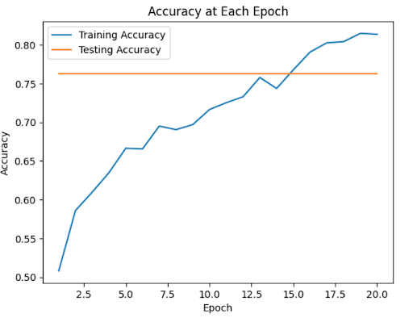
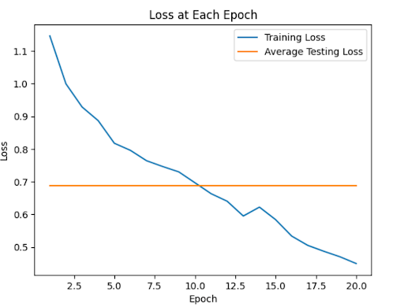
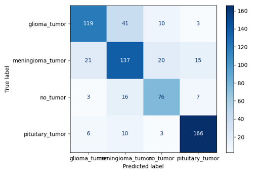

# 🧠 Tumor Detector
*A model designed to detect different types of tumors in MRI scans*

## 🔍 Overview  
**Goal:** This project was to train a variety of models and to determine which performed the best at detecting if a provided MRI image contained a tumor in the patients brain.
**Tech Used:** Python, PyTorch, SciKit Learn, Numpy 
**Status:** `Completed` 

---


## 📁 Dataset  
The data used was gathered from Kaggle [here](https://www.kaggle.com/datasets/sartajbhuvaji/brain-tumor-classification-mri/data)

---

## 🧠 What I Learned  
Initial performance was poor
– Baseline accuracy: ~54%

Blindly adding features can backfire
– Added dropout, more epochs & a learning-rate scheduler → accuracy dropped to ~44%
– More epochs only increased training time without benefit

Data splitting matters more than you’d think
– Merged original train/test sets & applied a random 80/20 split → accuracy jumped to ~68%

Hyperparameter tuning pays off
– Fine-tuning epochs & learning rate after re-split → final accuracy ~78%

---
### Loss at each epoch


### Accuracy at each epoch


### Confusion Matrix



## 📌 How to Run  
```bash
# Step 1: clone the repo
git clone https://github.com/your-username/project-name.git

# Step 2: install dependencies (if needed)
pip install -r requirements.txt

# Step 3: run or open your file

